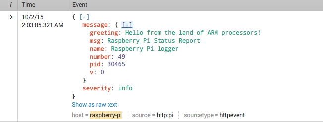

A simple demo sending events from a Raspberry Pi to Splunk's HTTP Event Collector.

## Setup the Raspberry Pi

This is the hard part, but you should only have to do this once.

0. Install git: `sudo apt-get isntall git`
0. Install nvm (Node.js Version manager): `curl -o- https://raw.githubusercontent.com/creationix/nvm/v0.27.1/install.sh | bash`
0. Install Node.js: `nvm install 4`
    - Binaries for ARM aren't available for older versions of Node.js. NVM still works fine, but it will take around 1 hour to build the binaries from source.
0. Configure nvm to use Node.js v4.x.x: `nvm use 4`
0. Check that Node.js is setup: `node -v`
0. Check that npm (Node.js Package Manager) is setup: `npm -v`

## Setup your Splunk 6.3+ instance

This part is very easy!
Your Splunk instance must be running on another machine,
it cannot run on the Raspberry Pi itself because of the
ARM architecture.

0. Enable HTTP Event Collector under Global Settings: http://splunk.local:8000/en-US/manager/launcher/http-eventcollector
0. Create a new token with the default settings.
0. Copy the token.

## Setup this demo app

0. Clone the project: `git clone git@github.com:shakeelmohamed/splunk-event-collector-raspbery-pi-bunyan.git`
0. Go to the project: `cd splunk-event-collector-raspbery-pi-bunyan`
0. Install depdendency `npm install`
0. Create `config.json` with your token & Splunk host: `{"token": "your-token-here", "host": "splunk.local"}`
0. Save the file.
0. Run a real-time search in Splunk: `http://splunk.local:8000/en-US/app/search/search?q=search%20host%3D%22raspberry-pi%22&display.page.search.mode=smart&earliest=rt-5m&latest=rt`
0. Run the app: `node index.js`
